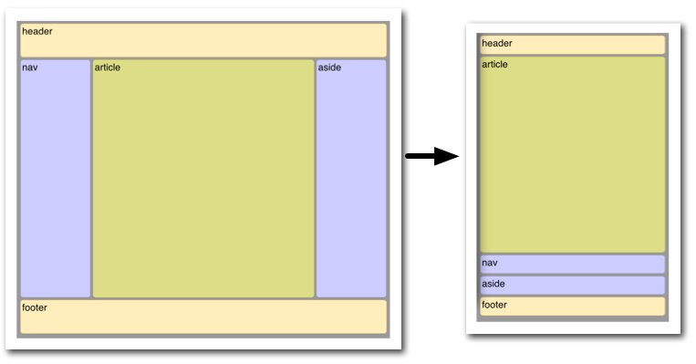

| Title | Type | Duration | Author |
| -- | -- | -- | -- |
| CSS Layouts With Flexbox | Lesson | 1:30 | Melissa Arliss and Sonyl Nagale  (adapted SF-SEI) |


# CSS Layouts With Flexbox


## Learning Objectives 

- Explain why flexbox is useful for modern web developers.
- Use flexbox to achieve vertical alignment and position the footer of a webpage.
- Choose which flex properties you'd use to solve a given problem.
- Contrast flex containers and flex items.
- Explain what is meant by the "Holy Grail Layout."

### LESSON GUIDE

| TIMING  | TYPE  | TOPIC  |
|:-:|---|---|
| 5 min  | Introduction  | CSS |
| 20 min  | Demo | Vertical Alignment |
| 20 min  | Demo | Making the Footer Stick |
| 30 min  | Independent Practice | More Flexbox Properties | 
| 10 min  | Introduction | The Holy Grail Layout |
| 5 min  | Conclusion | Review / Recap |
---

## Introduction (5 min)

HTML was created as a document-oriented language. CSS emerged as a way to use language to precisely define stylistic features in a way that wouldn't clutter the semantic content or, even worse, destroy the semantic value altogether. CSS pursued the related goal of normalizing styling across browsers. In many ways, it achieves this goal well, yet it remains one of the most frustrating parts of web development.


Today, we'll learn about a modern CSS tool to help with making an easier-to-write and more versatile website layout.  

Flexbox, a layout mode introduced with CSS3, is at this point widely implemented across different browsers.

> We can check https://caniuse.com/ to see which browsers support what we want to implement.  

With that, let's play a fun game called: "Let Flexbox Fix All Your (CSS) Problems."

---

## Problem 1: Vertical Alignment (20 min)

Let's start out by talking about a problem that anybody who has written CSS has likely dealt with:

*I have a `<div>`. I would like to center it vertically and horizontally on my page.*

The end result should look something like this...


### You Tell Me: What Should I Try?

Take about **five minutes** to try to get the `<div>` in this example centered like in the image above. Make sure it's still centered vertically and horizontally when you change the screen size.

Here's the starter HTML and CSS:

```html
<html>
  <body>
    <div> Div 1 </div>
  </body>
</html>
```

```CSS
body {
  min-height: 100vh;
  margin: 0 auto;
}

div {
  width: 100px;
  height: 100px;
  background: #990012;
  color: #FFFFFF;
  border-radius: 10px;
  font: 14pt Comic Sans MS;
  text-align: center;
  line-height: 100px;
}
```

<details>
  <summary><strong>These might work...</strong></summary>

  > **Padding**: The simplest approach would be to set equal padding on the top and bottom of the container (`<body>`) element. We would need to know the exact height of the element and container in order to get this exactly right. This can also get tedious when there is more than one element in a container.
  >
  > **Margin**: Similarly, we could add some margin to the element we are trying to center. The same issues remain.
  >
  > **Absolute positioning**: You could use properties such as `top` and `left` to position an element in the center. This, however, removes it from the document flow.

</details>

<details>
  <summary><strong>These could work in other scenarios...</strong></summary>

  > **`line-height`**: When vertically centering a single line of text, you can set the line height to that of the whole container.
  >
  > **`vertical-align`**: Is used to align words within a line of text (e.g., superscript, subscript).

</details>

The tough part: The proper method for vertically centering an element depends on its context, meaning that an element has to look to its parent and then align itself; siblings make this very difficult. Depending on your situation, one or more of the above techniques could work. [Here's an enlightening post on the matter](https://css-tricks.com/centering-in-the-unknown/).

### Flexbox to the Rescue!

```CSS
body {
  min-height: 100vh;
  margin: 0 auto;
  display: flex;
  justify-content: center;
  align-items: center;
}
```

### How It Works


When you declare `display: flex;` in a CSS rule, whatever is targeted by that rule becomes a **flex container**.

The flexbox approach differs from the methods described above in that the arrangement of elements is managed by the **parent** container. The child of a **flex container** is called a **flex item**. We can change the way flex items display by setting item-specific properties, which we'll cover later in the lesson.

After the `display` property, the most important flexbox property to understand is `flex-direction`. It is very important to remember that the `flex-direction` orients the **flex container's main axis**. The main axis can be set to run vertically or horizontally, depending on the value of `flex-direction`. All other flex-related properties are defined in terms of the main axis.

First, use `flex-direction` to indicate whether you want the flex items in the container to "read" left to right (`row`), right to left (`row-reverse`), top to bottom (`column`), **or** bottom to top (`column-reverse`).

| `flex-direction` | `main-axis` start |
|----------------|-----------------|
| `row` (default)  | Left            |
| `column`         | Top             |
| `row-reverse`    | Right           |
| `column-reverse` | Bottom          |

The `justify-content` property aligns content relative to the **main axis**. Possible values are: `flex-start` (default), `flex-end`, `center`, `space-between`, and `space-around`.

> What do you think each does? Does the `flex-direction` affect this?

The `align-items` property is similar to `justify-content` but aligns relative to the **cross axis**. There are similar options here: `flex-start`, `flex-end`, `center`, `stretch` (default), and `baseline` (items are aligned by their baselines/where the text is located).

By default, a **flex container** will arrange its children in a single row or column. The `flex-wrap` property can modify this with the values `nowrap` (default), `wrap`, and `wrap-reverse`.

When text is wrapping, `align-content` controls how the rows or columns are arranged relative to the cross axis: `flex-start`, `flex-end`, `stretch` (default), `center`, `space-between`, and `space-around`.

### In Summary...

| Property | What Does It Do? | Examples |
|----------|---------------|----------|
| **display**  |               | `flex`   |
| **[flex-direction](https://developer.mozilla.org/en-US/docs/Web/CSS/flex-direction)** | Sets the directional flow of flex items. | `row`, `column` |
| **[justify-content](https://developer.mozilla.org/en-US/docs/Web/CSS/justify-content)** | Aligns along the main axis. | `center`, `space-between` |
| **[align-items](https://developer.mozilla.org/en-US/docs/Web/CSS/align-items)** | Aligns along the cross axis. | `flex-start`, `center` |

> That's a lot of CSS properties! Don't worry, you're not expected to memorize all of them. Being a developer is less about knowing everything off the top of your head and more about knowing best practices and where to find more information. [Here's a great resource](https://css-tricks.com/snippets/css/a-guide-to-flexbox/).

---

## Problem 2: Make the Footer Stick (20 min)

*I want my footer to lie along the bottom of my page. Once I've accomplished that, I want to evenly distribute the content boxes horizontally inside of the `<main>` element.*


### You Tell Me: What Should I Try?

Let's start with this code:

```html
<html>
  <header>
    FlexBox
  </header>
  <main>
    <section>Content 1</section>
    <section>Content 2</section>
    <section>Content 3</section>
  </main>
  <footer>
    CodePen by Andrew Whitley
  </footer>
</html>
```

```CSS
body {
  min-height: 100vh;
  margin: 0 auto;
  font: 12pt Comic Sans MS;
}

header, footer {
  width: 100%;
  height: 30px;
  background: #000000;
  color: #FFFFFF;
  text-align: center;
  line-height: 30px;
}

main {
  background: #D3D3D3;
}

section {
  width: 100px;
  background: #990012;
  color: #FFFFFF;
  border-radius: 10px;
  margin: 5px;
  text-align: center;
  line-height: 100px;
}
```

Take five minutes to try to figure it out.

<details>
  <summary>Here's one option...</summary
    
Making the footer lie against the bottom of the screen is pretty easy — just use absolute or fixed positioning. However, using absolute or fixed positioning means everything else on the page ignores the footer. `<main>`'s text could easily run under the footer. We want the text to "push" the footer to the end of the page.

</details>

### Flexbox to the Rescue!

```CSS
body {
  min-height: 100vh;
  margin: 0 auto;
  font: 12pt Comic Sans MS;
  display: flex;
  flex-direction: column;
  justify-content: space-between;
}
```

<details>
  
  <summary><strong>How is the main axis of the body oriented here? What about the cross axis?</strong></summary>

  > Main: vertically, Cross: horizontally

</details>

Now, let's horizontally distribute the `<section>` elements containing the page's content inside of the `<main>`. What element should we style?

```CSS
main {
  background: #D3D3D3;
  display: flex;
  justify-content: space-around;
}
```

---

## You Do: More Flexbox Properties (20 min)

Time for you to research some more flexbox properties. You will be split into groups and assigned one of the following flex properties:

- `align-content`
- `flex-grow`
- `flex-wrap`
- `order`
- `flex-basis`

Your task is to...
* Come up with an [ELI5 ("Explain Like I'm 5")](https://www.reddit.com/r/explainlikeimfive) definition for the property.
* List the different values this property can take.
* Create a simple example (HTML and CSS) to demonstrate how the property works.

If you finish early, try exploring some of the [other flexbox properties](https://css-tricks.com/snippets/css/a-guide-to-flexbox/) not assigned in this exercise.

### Recap

<details>
  <summary><strong><code>align-content</code></strong></summary>

  > How multiple rows or columns are spaced along the cross axis; takes the same properties as `justify-content`.
  >
  > [Example](https://codepen.io/perryf/pen/RQNYPM)

</details>

<details>
  <summary><strong><code>flex-grow</code></strong></summary>

  > If the flex container is too big for all the flex items, `flex-grow` specifies the relative proportion a particular flex item will occupy.
  >
  > [Example](https://codepen.io/perryf/pen/aqzaRV)

</details>

<details>
  <summary><strong><code>flex-wrap</code></strong></summary>

  > Defines flex item behavior if there's expansion beyond a single line.
  >
  > [Example](https://codepen.io/perryf/pen/vdEzMv)

</details>

<details>
  <summary><strong><code>order</code></strong></summary>

  > Specifies the order in which you want flex items to appear along the main axis. The default is `0`. Negative numbers are allowed.

</details>

<details>
  <summary><strong><code>flex-basis</code></strong></summary>

  > Specifies how big the flex items "want" to be, or the initial size of a flex item.
  >
  > [Example](http://gedd.ski/post/the-difference-between-width-and-flex-basis/)

</details>


## The Holy Grail Layout (10 min)



This is something you know well, even if you don't recognize the term. It describes a webpage with a header bar, footer bar, and three columns along the middle: a wide "main" column, a navigation column on the left, and an advertisement, sitemap, or extra info column along the right.

Obviously, this layout won't work on tiny screens (unless you really like super-skinny columns). It's common to stack things on top of each other in mobile views to make one single column.

Before flexbox, this involved a lot of pushing and shoving with dimensions and positioning. You would essentially have to write two completely separate style sheets: one for mobile, and one for desktop.

With flexbox, just change the `flex-direction` for smaller screen sizes, make any size/order adjustments on the sections of the page, and you're pretty much done!

```css
@media screen and (max-width: 600px){
  main {
    flex-direction: column;
  }

  section {
    order: 1;
  }
}
```

> A layout so holy, [it has its own Wikipedia article](https://en.wikipedia.org/wiki/Holy_Grail_(web_design)).

[Example](http://codepen.io/awhitley1233/pen/XpKzqV)

## Conclusion (5 min)

Let's recap with by considering these questions:

- Why is alignment so important in modern web development?
- What problems does flexbox solve?
- Where do I put `display: flex` or `display: grid`?
- With flexbox, what are some properties that `justify-content` can take?

---

## Resources

* [flexbox.io](https://flexbox.io/)
* [The Ultimate Flexbox Cheat Sheet](http://www.sketchingwithcss.com/samplechapter/cheatsheet.html)
* [CSS-Tricks' Guide to Flexbox](https://css-tricks.com/snippets/css/a-guide-to-flexbox/)
* [A Visual Guide to CSS3 Flexbox Properties](https://scotch.io/tutorials/a-visual-guide-to-css3-flexbox-properties)
* [Solved by Flexbox](http://philipwalton.github.io/solved-by-flexbox/)
* [Flexplorer](http://bennettfeely.com/flexplorer/)

